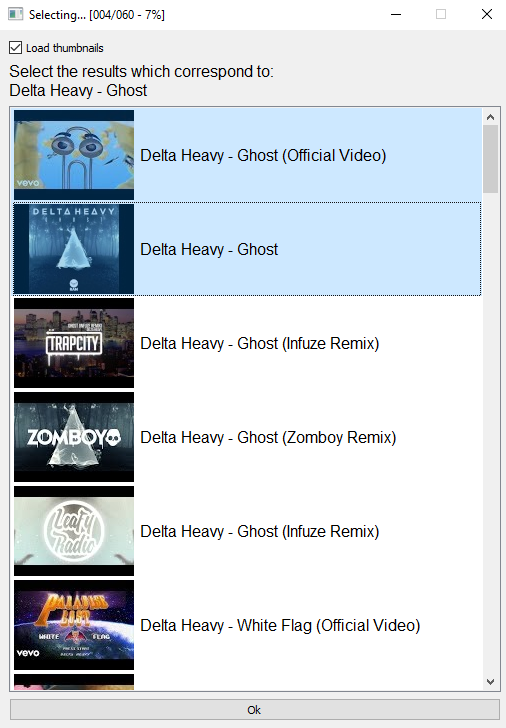

# SongTitleParser
---

I'm trying to make a program that can parse Title/Artist pairs from YouTube song titles (no matter how dodgy the format)

I haven't yet decided if I'm going to use Machine Learning or just normal techniques, but in any case, I'm gathering a dataset right now.

## Dataset Creation
The dataset is created from tagged song files (which already have correct artist and title tags) and YouTube, using `dataset/gen.py`.
- The script searches YouTube for `<artist name> - <song title>` for each input song file presents the user with the search results.
- The user then selects which search results correspond to the song for each file.<br>
- The program records titles (and YouTube ids) of the selected results, alongside the ground truth artist and song title values for each song
- In this way, we create a dataset of YouTube title - Title/Artist pairs

### Screenshot:


### Help with the Dataset
To use the program, you will need a [YouTube API key](https://developers.google.com/youtube/v3/) and music with correct Title and Artist metadata tags. Mp3 files should definitely work, other formats may also work but haven't been tested.

```
git clone https://github.com/pixelzerg/SongTitleParser.git
cd dataset
pip3 install -r requirements.txt
export YOUTUBE_API_KEY="<youtube api key here>"
python3 gen.py "/path/to/music/folder/"
```

Data will be outputed to `out.json`. The program can be closed in the middle of going through a folder and will resume from where you left off.

NB: the music in the folder provided will be loaded recursively.